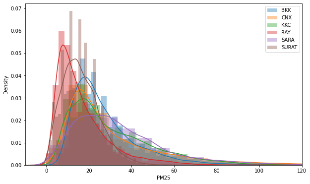
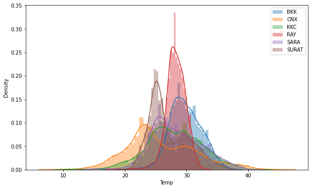
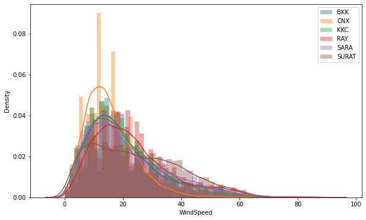
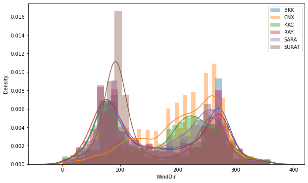
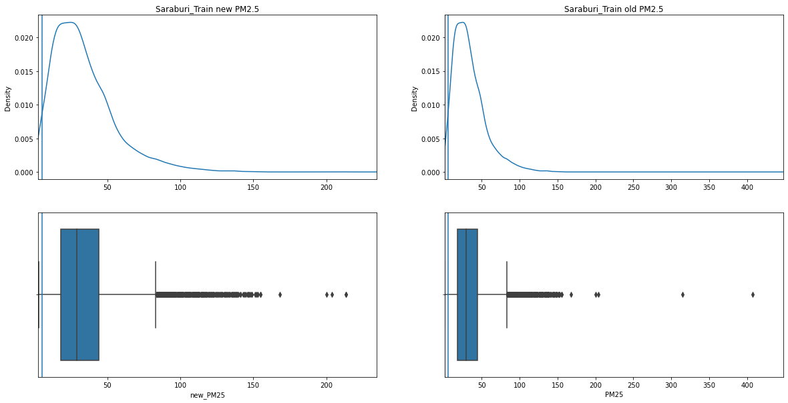

# 2110446-data-science-and-data-engineering-2021

### Data Science Project1 (2021/2) PM2.5 Kaggle

### by One Night Miracle

---

## Introduction

This project consisted of 11 python notebooks in uses :
- 1 data-scraping notebooks
- 3 data-preparation-and-analysis notebooks
- 7 model-training notebooks

#### IPYNB

```
- data_scraping.ipynb
- data_analysis.ipynb
- model_province/
└───data_resample_6H.ipynb
└───model_BKK.ipynb
└───model_CNX.ipynb
└───model_KKC.ipynb
└───model_RAY.ipynb
└───model_SARA.ipynb
└───model_SURAT.ipynb
- random_search.ipynb
- data_before_submission.ipynb
```

## Data Scrape

We got all of train dataset {PM2.5, Temperature, Wind Speed, Wind Direction}, and only PM2.5 for test dataset from [Kaggle:2110446-data-science-and-data-engineering-2022](https://www.kaggle.com/competitions/2110446-data-science-and-data-engineering-2022) .

#### dataset (before scraping)

```
- datasci_dataset_2022/
└───BKK/
    └───train
    |    - bkk_temp_surface.csv
    |    - bkk_train.csv
    |    - bkk_weather_wind.csv
    |    - position.txt
    └───test
    |    - bkk_test.csv
└───Chiangmai/
    └───train
    |    - chiangmai_temp_surface.csv
    |    - chiangmai_train.csv
    |    - chiangmai_weather_wind.csv
    |    - position.txt
    └───test
    |    - chiangmai_test.csv
└───Khonkaen/
    └───train
    |    - khonkaen_temp_surface.csv
    |    - khonkaen_train.csv
    |    - khonkaen_weather_wind.csv
    |    - position.txt
    └───test
    |    - khonkhan_test.csv (Beware of its name!)
└───Rayong/
    └───train
    |    - rayong_temp_surface.csv
    |    - rayong_train.csv
    |    - rayong_weather_wind.csv
    |    - position.txt
    └───test
    |    - rayong_test.csv
└───Saraburi/
    └───train
    |    - saraburi_temp_surface.csv
    |    - saraburi_train.csv
    |    - saraburi_weather_wind.csv
    |    - position.txt
    └───test
    |    - saraburi_test.csv
└───Surat/
    └───train
    |    - surat_temp_surface.csv
    |    - surat_train.csv
    |    - surat_weather_wind.csv
    |    - position.txt
    └───test
    |    - surat_test.csv
```

Therefore, we, as the One-Night-Miracle team, implemented data_scraping.ipynb to complete the test dataset. \

The python notebook was scraping the missing data from https://classic.nullschool.net/ with Selenium library. \
Then, the results were saved into as .csv files in [BKK/test](https://github.com/One-Night-Miracle/Data-Science-Project1-2021-2-PM2.5-Kaggle/tree/merged/datasci_dataset_2022/BKK/test), [Chiangmai/test](https://github.com/One-Night-Miracle/Data-Science-Project1-2021-2-PM2.5-Kaggle/tree/merged/datasci_dataset_2022/Chiangmai/test), [Khonkaen/test](https://github.com/One-Night-Miracle/Data-Science-Project1-2021-2-PM2.5-Kaggle/tree/merged/datasci_dataset_2022/Khonkaen/test), [Rayong/test](https://github.com/One-Night-Miracle/Data-Science-Project1-2021-2-PM2.5-Kaggle/tree/merged/datasci_dataset_2022/Rayong/test), [Saraburi/test](https://github.com/One-Night-Miracle/Data-Science-Project1-2021-2-PM2.5-Kaggle/tree/merged/datasci_dataset_2022/Saraburi/test), [Surat/test](https://github.com/One-Night-Miracle/Data-Science-Project1-2021-2-PM2.5-Kaggle/tree/merged/datasci_dataset_2022/Surat/test).

#### dataset (only newly added files)

```
- datasci_dataset_2022/
└───BKK/
    └───test
    |    - bkk_temp_test.csv
    |    - bkk_wind_test.csv
└───Chiangmai/
    └───test
    |    - chiangmai_temp_test.csv
    |    - chiangmai_wind_test.csv
└───Khonkaen/
    └───test
    |    - khonkaen_temp_test.csv
    |    - khonkaen_wind_test.csv
└───Rayong/
    └───test
    |    - rayong_temp_test.csv
    |    - rayong_wind_test.csv
└───Saraburi/
    └───test
    |    - saraburi_temp_test.csv
    |    - saraburi_wind_test.csv
└───Surat/
    └───test
    |    - surat_temp_test.csv
    |    - surat_wind_test.csv
```

## Data Preparation and Data Analysis

After the dataset was completed from previous step, the dataset would be performed step by step as follwings:

#### STEP1

the dataset was read into dataframe [csv_df.py](https://github.com/One-Night-Miracle/Data-Science-Project1-2021-2-PM2.5-Kaggle/blob/merged/custom_function/csv_df.py). \
There're two functions: toDF, and toDFtest implemented with Pandas library. \
The functions were to prepare the dataset by interpolating hourly-missing data, and merging the dataset from 4 different features {PM2.5, Temperature, Wind Speed, Wind Direction} into single dataframe to support the data analysis.

#### STEP2

The null values in the train dataset were dropped in order to avoid errors for model learning.

#### STEP2

The features was seperately plotted to compare the simalarity of the trends for all provinces. \
The graphs of features on time series showed that feature trends were highly related.






#### STEP3

The outliers in PM2.5-feature dataset were eliminated by limiting the min and max threshold for the entire dataset.\
In this step, the feature was reformed with logarithm function, and performed the elimination on the logarithm values.



#### STEP4

We exported the clean dataset into 2 types:
- csv:
```
- clean_dataset_2022/
└───BKK/
|    - bkk_test.csv
|    - bkk_train.csv
└───Chiangmai/
|    - chiangmai_test.csv
|    - chiangmai_train.csv
└───Khonkaen/
|    - khonkaen_test.csv
|    - khonkaen_train.csv
└───Rayong/
|    - rayong_test.csv
|    - rayong_train.csv
└───Saraburi/
|    - saraburi_test.csv
|    - saraburi_train.csv
└───Surat/
|    - surat_test.csv
|    - surat_train.csv
```

- bin:
```
- clean_dataset_2022/
└───test_set.bin
└───train_set.bin
```
